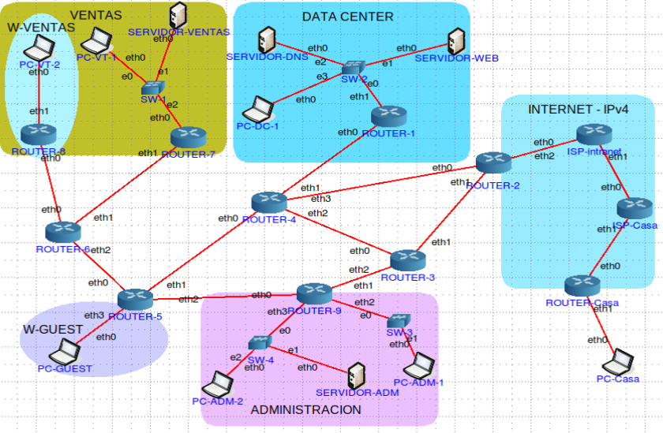

# Laboratorio de Infraestructura de Red empresarial IPv6

Proyecto académico de redes enfocado en el diseño, configuración y validación de una red empresarial IPv6 utilizando routers y hosts basados en Linux.

---

## Descripción General

Este proyecto simula una red empresarial de tamaño mediano compuesta por múltiples departamentos, servicios internos y conectividad externa.

La infraestructura fue diseñada y configurada manualmente utilizando herramientas de red de Linux y tecnologías IPv6.

### Principales Objetivos
- Diseño de un plan de direccionamiento IPv6 (global y ULA)
- Configuración de enrutamiento estático
- Enrutamiento basado en políticas de tráfico
- Túneles IPv6 sobre IPv4 (SIT) para conectividad externa
- Router Advertisement (RADVD) para autoconfiguración de clientes
- Conectividad de servicios DNS y Web
- Resolución de problemas y validación de red
- Análisis de tráfico utilizando Wireshark

---
## Funcionalidades Implementadas

### Diseño de Direccionamiento IPv6
Se diseñaron y asignaron esquemas de direccionamiento IPv6:
- **Prefijo Global:** `2001:1200:0:21f0::/60` subdividido en redes `/64` y enlaces `/127`
- **Direcciones Únicas Locales (ULA):** Espacio `fd00::/8` para administración interna

### Infraestructura de Enrutamiento
Se configuró enrutamiento estático en todos los routers para permitir la comunicación entre todas las redes internas y externas, incluyendo rutas por defecto hacia el ISP y el túnel SIT.
### Enrutamiento Basado en Políticas
- **Tráfico desde W-GUEST:** Forzado a pasar por Router-9, aislando la red de invitados internos
- **Tráfico TCP externo:** Forzado a pasar por Router-3, mientras que otros protocolos usan la ruta por defecto
### Túneles IPv6 sobre IPv4 (SIT) 
Se configuraron túneles SIT para transportar tráfico IPv6 a través de la red del ISP (solo IPv4).
### Router Advertisemen (RADVD)
Se implementó RADVD en los routers para automatizar la configuración de direcciones IPv6 en los dispositivos cliente mediante SLAAC.
### Validación de Conectividad
Se verificó el funcionamiento de la red utilizando:

| Herramienta   | Propósito                                                |
| ------------- | -------------------------------------------------------- |
| `ping6`       | Pruebas básicas de conectividad                          |
| `traceroute6` | Descubrimiento de ruta y análisis de saltos              |
| `netcat` (nc) | Pruebas de comunicación a nivel de transporte (UDP)      |
| `tcpdump`     | Captura de paquetes en tiempo real                       |
| **Wireshark** | Inspección profunda de paquetes y análisis de protocolos |

## Contenido del Repositorio
El repositorio contiene los siguientes elementos principales:
### Informe Técnico
El documento ``Informe tecnico.pdf`` recopila toda la documentación del proyecto, incluyendo el plan de direccionamiento, las configuraciones completas de todos los equipos, las políticas de enrutamiento implementadas y el análisis de tráfico con capturas de Wireshark.

### Archivos de Emulación (CORE)
Se incluyen dos archivos de topología para el emulador **CORE (Common Open Research Emulator)**

- **`network.imn`** — Configuración con direccionamiento IPv6 manual en todos los equipos (sin RADVD).
- **`network-radvd.imn`** — Configuración con RADVD habilitado para autoconfiguración de clientes mediante SLAAC.

Ambos archivos comparten la misma topología de red y configuraciones de enrutamiento, diferenciándose únicamente en el método de asignación de direcciones a los hosts finales.
